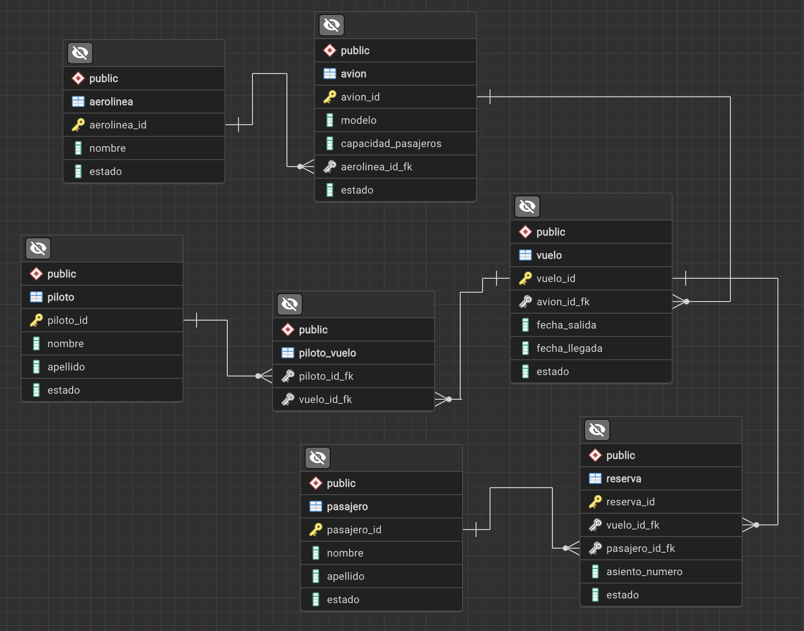

# Examen Spring ## Base de datos (Codigo)
```sql
-- Tabla `aerolinea`:
CREATE TABLE aerolinea (
    aerolinea_id SERIAL PRIMARY KEY,  -- Identificador único para cada aerolínea
    nombre VARCHAR(255),              -- Nombre de la aerolínea
    estado BOOLEAN                     -- Estado actual de la aerolínea (activo/inactivo)
);

-- Tabla `avion`:
CREATE TABLE avion (
    avion_id SERIAL PRIMARY KEY,      -- Identificador único para cada avión
    modelo VARCHAR(255),               -- Modelo del avión
    capacidad_pasajeros INT,           -- Número de pasajeros que puede transportar el avión
    aerolinea_id_fk INT,               -- Clave foránea que se relaciona con aerolinea(aerolinea_id)
    estado BOOLEAN                      -- Estado actual del avión (activo/inactivo)
);

-- Tabla `vuelo`:
CREATE TABLE vuelo (
    vuelo_id SERIAL PRIMARY KEY,       -- Identificador único para cada vuelo
    avion_id_fk INT,                   -- Clave foránea que se relaciona con avion(avion_id)
    fecha_salida DATE,                 -- Fecha de salida del vuelo
    fecha_llegada DATE,                -- Fecha de llegada del vuelo
    estado BOOLEAN                      -- Estado actual del vuelo (activo/inactivo)
);

-- Tabla `piloto`:
CREATE TABLE piloto (
    piloto_id SERIAL PRIMARY KEY,      -- Identificador único para cada piloto
    nombre VARCHAR(255),               -- Nombre del piloto
    apellido VARCHAR(255),             -- Apellido del piloto
    estado BOOLEAN                      -- Estado actual del piloto (activo/inactivo)
);

-- Tabla `piloto_vuelo`:
CREATE TABLE piloto_vuelo (
    piloto_id_fk INT,                  -- Clave foránea que se relaciona con piloto(piloto_id)
    vuelo_id_fk INT                    -- Clave foránea que se relaciona con vuelo(vuelo_id)
);

-- Tabla `pasajero`:
CREATE TABLE pasajero (
    pasajero_id SERIAL PRIMARY KEY,    -- Identificador único para cada pasajero
    nombre VARCHAR(255),               -- Nombre del pasajero
    apellido VARCHAR(255),             -- Apellido del pasajero
    estado BOOLEAN                      -- Estado actual del pasajero (activo/inactivo)
);

-- Tabla `reserva`:
CREATE TABLE reserva (
    reserva_id SERIAL PRIMARY KEY,     -- Identificador único para cada reserva
    vuelo_id_fk INT,                   -- Clave foránea que se relaciona con vuelo(vuelo_id)
    pasajero_id_fk INT,                -- Clave foránea que se relaciona con pasajero(pasajero_id)
    asiento_numero INT,                -- Número de asiento reservado
    estado BOOLEAN                      -- Estado actual de la reserva (activo/inactivo)
);

```
## ERD


## Tareas
1. Crear los endpoints necesarios para poder crear y consultar la informacion de las tablas `aerolinea`, `avion`, `vuelo`, `piloto`, `piloto_vuelo`, `pasajero` y `reserva`.
2. Cada endpoint debe tener una URI con el siguiente formato `http://127.0.0.1:8080/api/v1/recurso/`. Reemplace 'recurso' con el nombre del recurso que desea tratar.
3. El endpoint para guardar un recurso debe tener el método POST y el endpoint para consultar un recurso debe tener el método GET.
4. Ejemplo de URI para consultar guardar un vuelo `http://127.0.0.1:8080/api/v1/vuelo/save`
5. Ejemplo de URI para consultar un vuelo por id `http://127.0.0.1:8080/api/v1/vuelo/get/1`.
6. Se debe de implementar una clase ResponseBase con los atributos `status`, `code`, `message` y `data` para devolver la respuesta de los endpoints. Donde `status` es el estado de la operación (true/false), `code` es el código de estado de la operación (200, 400, 404, 500, etc), `message` es el mensaje de la operación y `data` es la información que se desea devolver.

## Aerolinea
1. Crear una aerolinea:
```json
{
  "nombre": "AirExpress",
  "estado": true
}
```
2. Buscar la aerolinea creada (respuesta):
```json
{
    "id": 1,
    "nombre": "AirExpress",
    "estado": true
}
```
## Avion
1. Crear un avion:
```json
{
  "modelo": "Boeing 737",
  "capacidad_pasajeros": "150",
  "estado": true,
  "aerolinea": {
    "id": 1
  }
}
```
2. Buscar el avion creado (respuesta):
```json
{
    "id": 1,
    "modelo": "Boeing 737",
    "capacidad": 0,
    "estado": true,
    "aerolinea": {
        "id": 1,
        "nombre": "AirExpress",
        "estado": true
    }
}
```
## Vuelo
1. Crear un vuelo:
```json
{
  "fechaSalida": "2024-02-02T12:00:00",
  "fechaLlegada": "2024-02-02T15:00:00",
  "avion": {
    "id": 1
  }
}
```
2. Buscar el vuelo creado (respuesta):
```json
{
    "id": 1,
    "fechaSalida": "2024-02-02T05:00:00.000+00:00",
    "fechaLlegada": "2024-02-02T05:00:00.000+00:00",
    "avion": {
        "id": 1,
        "modelo": "Boeing 737",
        "capacidad": 0,
        "estado": true,
        "aerolinea": {
            "id": 1,
            "nombre": "AirExpress",
            "estado": true
        }
    }
}
```
## Piloto
1. Crear un piloto:
```json
{
  "nombre": "Carlos",
  "apellido": "Gómez",
  "estado": true,
  "vuelos": [
    {
        "id": 1
    }
  ]
}
```
2. Buscar el piloto creado (respuesta):
```json
{
    "id": 1,
    "nombre": "Carlos",
    "apellido": "Gómez",
    "estado": true,
    "vuelos": [
        {
            "id": 1,
            "fechaSalida": "2024-02-02T05:00:00.000+00:00",
            "fechaLlegada": "2024-02-02T05:00:00.000+00:00",
            "avion": {
                "id": 1,
                "modelo": "Boeing 737",
                "capacidad": 0,
                "estado": true,
                "aerolinea": {
                    "id": 1,
                    "nombre": "AirExpress",
                    "estado": true
                }
            }
        }
    ]
}
```
## Pasajero
1. Crear un pasajero:
```json
{
  "nombre": "Juan",
  "apellido": "Pérez",
  "estado": true
}
```
2. Buscar el pasajero creado (respuesta):
```json
{
    "id": 1,
    "nombre": "Juan",
    "apellido": "Pérez",
    "estado": true
}
```
## Reserva
1. Crear una reserva:
```json
{
    "numAsiento": 12,
    "estado": true,
    "vuelo": {
        "id": 1
    },
    "pasajero":{
        "id": 1
    }
}
```
2. Buscar la reserva creada (respuesta):
```json
{
    "id": 1,
    "numAsiento": 12,
    "estado": true,
    "vuelo": {
        "id": 1,
        "fechaSalida": "2024-02-02T05:00:00.000+00:00",
        "fechaLlegada": "2024-02-02T05:00:00.000+00:00",
        "avion": {
            "id": 1,
            "modelo": "Boeing 737",
            "capacidad": 0,
            "estado": true,
            "aerolinea": {
                "id": 1,
                "nombre": "AirExpress",
                "estado": true
            }
        }
    },
    "pasajero": {
        "id": 1,
        "nombre": "Juan",
        "apellido": "Pérez",
        "estado": true
    }
}
```